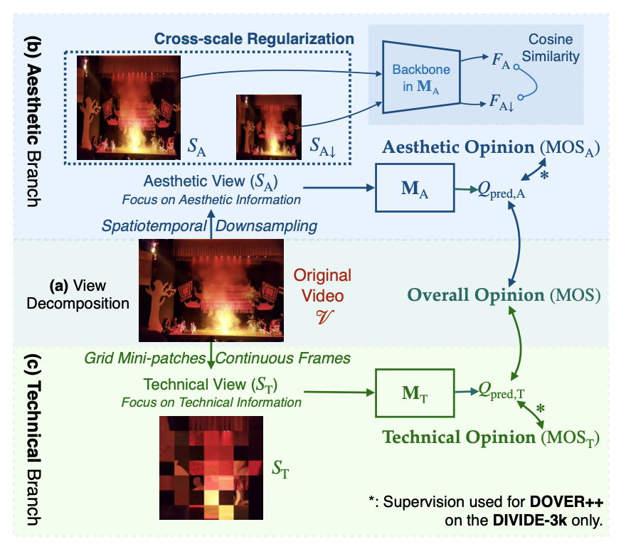

# DOVER: the Disentangled Objective Video Quality Evaluator

*Should be some papers-with-code banner here as it is SOTA...but due to "some" regulations we will do this later...*

The first attempt to disentangle the VQA problem.
As proposed by paper "Disentangling Aesthetic and Technical Effects for Video Quality Assessment of User Generated Content".

Arxiv Paper Link will be here soon.


## Introduction

### Problem Definition


### the proposed DOVER




## Install

The repository can be installed via the following commands:
```shell
    git clone https://github.com/teowu/DOVER.git
    cd DOVER
    pip install .
```

## Data Preparation

We have already converted the labels for every dataset you will need for Blind Video Quality Assessment,
and the download links for the videos are as follows:

LSVQ: [Github](https://github.com/baidut/PatchVQ)
KoNViD-1k: [Official Site](http://database.mmsp-kn.de/konvid-1k-database.html)
LIVE-VQC: [Official Site](http://live.ece.utexas.edu/research/LIVEVQC)
YouTube-UGC: [Official Site](https://media.withyoutube.com)

After downloading, kindly put them under the `../datasets` or anywhere but remember to change the `data_prefix` in the [config file](dover.yml).


## Default Inference

To test the pre-trained DOVER on multiple datasets, please run the following shell command:

```shell
    python default_infer.py
```

## Visualization

### Divergence Maps

Please follow the instructions in [Generate_Divergence_Maps_and_gMAD.ipynb] to generate them.
You can also get to visualize the videos (but you need to download the data first).

### WandB Training and Evaluation Curves

You can be monitoring your results on WandB!
Though training codes will only be released upon the paper's acceptance, you may consider to modify the [FAST-VQA's fine-tuning scripts](https://github.com/teowu/FAST-VQA-and-FasterVQA/blob/dev/split_train.py) as we have done to reproduce the results.

Or, just take a look at our training curves that are made public: 

[Official Curves](https://wandb.ai/timothyhwu/DOVER)

and welcome to reproduce them!


## Results

### Score-level Fusion

Directly training on LSVQ and testing on other datasets:

|    | PLCC@LSVQ_1080p | PLCC@LSVQ_test | PLCC@LIVE_VQC | PLCC@KoNViD | MACs | config | model |
| ----  |    ----   |   ---- |  ----   |    ----   | ----  |    ----   |   ---- | 
|  DOVER |  0.830 |  0.889  |   0.855 | 0.883   |  282G  |  [config](dover.yml)  | [github](https://github.com/teowu/DOVER/releases/download/v0.1.0/DOVER.pth) |

### Representation-level Fusion

Transfer learning on smaller datasets:

|       | KoNViD-1k | CVD2014 | LIVE-VQC | YouTube-UGC |
| ----  |    ----   |   ---- |  ----   |    ----   |
| SROCC | 0.906 | 0.894 | 0.858 | 0.880 |
| PLCC  | 0.905 | 0.908 | 0.874 | 0.874 |


## Acknowledgement

Thanks @annanwangdaniel for developing the interfaces for subjective studies.

## Citation

Should you find this work interesting and would like to cite this, please feel free to add these in your papers!

```bibtex
@article{wu2022disentanglevqa,
  title={Disentangling Aesthetic and Technical Effects for Video Quality Assessment of User Generated Content},
  author={Wu, Haoning and Liao, Liang and Chen, Chaofeng and Hou, Jingwen and Wang, Annan and Sun, Wenxiu and Yan, Qiong and Lin, Weisi},
  year={2022}
}
```