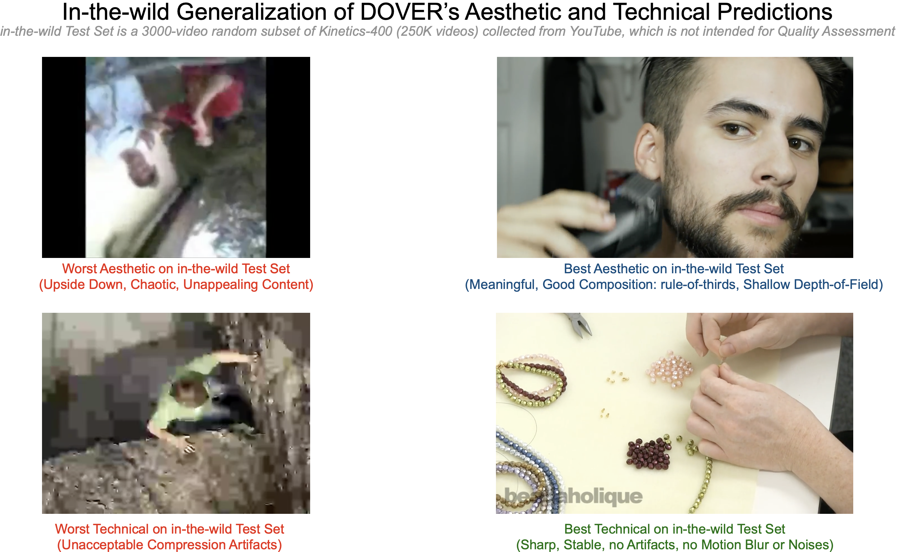
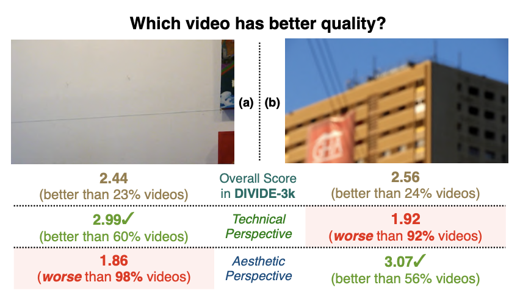

# DOVER

Official Codes, Demos, Models for the [Disentangled Objective Video Quality Evaluator (DOVER)](arxiv.org/abs/2211.04894v2).

- 19 Dec, 2022: Training Code for *Head-only Transfer Learning* is ready!! See [training](https://github.com/QualityAssessment/DOVER#training-adapt-dover-to-your-video-quality-dataset).
- 18 Dec, 2022: 感谢媒矿工厂提供中文解读。Thrid-party Chinese Explanation on this paper: [微信公众号](https://mp.weixin.qq.com/s/NZlyTwT7FAPkKhZUNc-30w).
- 10 Dec, 2022: Now the evaluation tool can directly predict a fused score for any video. See [here](https://github.com/QualityAssessment/DOVER#new-get-the-fused-quality-score-for-use).


 [](https://github.com/QualityAssessment/DOVER)
[](https://github.com/QualityAssessment/DOVER)
<a href="https://colab.research.google.com/github/taskswithcode/DOVER/blob/master/TWCDOVER.ipynb"></a> 


**DOVER** Pseudo-labelled Quality scores of [Kinetics-400](https://www.deepmind.com/open-source/kinetics): [CSV](https://github.com/QualityAssessment/DOVER/raw/master/dover_predictions/kinetics_400_1.csv)

**DOVER** Pseudo-labelled Quality scores of [YFCC-100M](http://projects.dfki.uni-kl.de/yfcc100m/): [CSV](https://github.com/QualityAssessment/DOVER/raw/master/dover_predictions/yfcc_100m_1.csv)


[](https://paperswithcode.com/sota/video-quality-assessment-on-konvid-1k?p=disentangling-aesthetic-and-technical-effects)
[](https://paperswithcode.com/sota/video-quality-assessment-on-live-fb-lsvq?p=disentangling-aesthetic-and-technical-effects)
[](https://paperswithcode.com/sota/video-quality-assessment-on-live-vqc?p=disentangling-aesthetic-and-technical-effects)
[](https://paperswithcode.com/sota/video-quality-assessment-on-youtube-ugc?p=disentangling-aesthetic-and-technical-effects)




Corresponding video results can be found [here](https://github.com/QualityAssessment/DOVER/tree/master/figs).

The first attempt to disentangle the VQA problem into aesthetic and technical quality evaluations.
Official code for ArXiv Preprint Paper *"Disentangling Aesthetic and Technical Effects for Video Quality Assessment of User Generated Content"*.


## Introduction

### Problem Definition



### the proposed DOVER


## Install

The repository can be installed via the following commands:
```shell
git clone https://github.com/QualityAssessment/DOVER.git 
cd DOVER 
pip install .  #stop here if you do not need pretrained weights, but why not?
mkdir pretrained_weights 
cd pretrained_weights 
wget https://github.com/QualityAssessment/DOVER/releases/download/v0.1.0/DOVER.pth 
cd ..
```

## Evaluation: Judge the Quality of Any Video

### Try on Demos


You can run a single command to judge the quality of the demo videos in comparison with videos in VQA datasets.

```shell
    python evaluate_one_video.py -v ./demo/17734.mp4
```

or 

```shell
    python evaluate_one_video.py -v ./demo/1724.mp4
```


### Evaluate on your customized videos


Or choose any video you like to predict its quality:


```shell
    python evaluate_one_video.py -v $YOUR_SPECIFIED_VIDEO_PATH$
```

### Outputs

You should get some outputs as follows. As different datasets have different scales, an absolute video quality score is useless, but the comparison on both **aesthetic** and **techincal quality** between the input video and all videos in specific sets are good indicators for how good the quality of the video is.

In the current version, you can get the analysis of the video's quality as follows (the normalized scores are following `N(0,1)`, so you can expect scores > 0 are related to better quality).


```
Compared with all videos in the LIVE_VQC dataset:
-- the technical quality of video [./demo/17734.mp4] is better than 43% of videos, with normalized score 0.10.
-- the aesthetic quality of video [./demo/17734.mp4] is better than 64% of videos, with normalized score 0.51.
Compared with all videos in the KoNViD-1k dataset:
-- the technical quality of video [./demo/17734.mp4] is better than 75% of videos, with normalized score 0.77.
-- the aesthetic quality of video [./demo/17734.mp4] is better than 91% of videos, with normalized score 1.21.
Compared with all videos in the LSVQ_Test dataset:
-- the technical quality of video [./demo/17734.mp4] is better than 69% of videos, with normalized score 0.59.
-- the aesthetic quality of video [./demo/17734.mp4] is better than 79% of videos, with normalized score 0.85.
Compared with all videos in the LSVQ_1080P dataset:
-- the technical quality of video [./demo/17734.mp4] is better than 53% of videos, with normalized score 0.25.
-- the aesthetic quality of video [./demo/17734.mp4] is better than 54% of videos, with normalized score 0.25.
Compared with all videos in the YouTube_UGC dataset:
-- the technical quality of video [./demo/17734.mp4] is better than 71% of videos, with normalized score 0.65.
-- the aesthetic quality of video [./demo/17734.mp4] is better than 80% of videos, with normalized score 0.86.
```

### New! Get the Fused Quality Score for Use!

Simply add an `-f` argument, the script now can directly score the video's quality between [0,1].

```shell
    python evaluate_one_video.py -f -v $YOUR_SPECIFIED_VIDEO_PATH$
```


## Evaluate on a Set of Unlabelled Videos


```shell
    python evaluate_a_set_of_videos.py -in $YOUR_SPECIFIED_DIR$ -out $OUTPUT_CSV_PATH$
```

The results are stored as `.csv` files in dover_predictions in your `OUTPUT_CSV_PATH`.

Please feel free to use DOVER to pseudo-label your non-quality video datasets.


## Data Preparation

We have already converted the labels for every dataset you will need for Blind Video Quality Assessment,
and the download links for the videos are as follows:

:book: LSVQ: [Github](https://github.com/baidut/PatchVQ)

:book: KoNViD-1k: [Official Site](http://database.mmsp-kn.de/konvid-1k-database.html)

:book: LIVE-VQC: [Official Site](http://live.ece.utexas.edu/research/LIVEVQC)

:book: YouTube-UGC: [Official Site](https://media.withyoutube.com)

After downloading, kindly put them under the `../datasets` or anywhere but remember to change the `data_prefix` in the [config file](dover.yml).


## Dataset-wise Default Inference

To test the pre-trained DOVER on multiple datasets, please run the following shell command:

```shell
    python default_infer.py
```

# Training: Adapt DOVER to your video quality dataset!

Now you can employ ***head-only transfer*** of DOVER to get dataset-specific VQA prediction heads. As we have evaluated in the paper, this method has very similar performance with *end-to-end transfer* (usually 1%~2% difference), but will require **much less** GPU memory, as follows:

```shell
    python transfer_learning.py -t $YOUR_SPECIFIED_DATASET_NAME$
```

For existing public datasets, type the following commands for respective ones:

- `python transfer_learning.py -t val-kv1k` for KoNViD-1k.
- `python transfer_learning.py -t val-tyugc` for YouTube-UGC.
- `python transfer_learning.py -t val-cvd2014` for CVD2014.
- `python transfer_learning.py -t val-livevqc` for LIVE-VQC.


As the backbone will not be updated here, the checkpoint saving process will only save the regression heads with only `398KB` file size (compared with `200+MB` size of the full model). To use it, simply replace the head weights with the official weights [DOVER.pth](https://github.com/teowu/DOVER/releases/download/v0.1.0/DOVER.pth).

Fine-tuning curves by authors can be found here: [Official Curves](https://wandb.ai/timothyhwu/DOVER) for reference.


## Visualization

### Divergence Maps

Please follow the instructions in [Generate_Divergence_Maps_and_gMAD.ipynb](Generate_Divergence_Maps_and_gMAD.ipynb) to generate them.
You can also get to visualize the videos (but you need to download the data first).

### WandB Training and Evaluation Curves

You can be monitoring your results on WandB!
Though training codes will only be released upon the paper's acceptance, you may consider to modify the [FAST-VQA's fine-tuning scripts](https://github.com/teowu/FAST-VQA-and-FasterVQA/blob/dev/split_train.py) as we have done to reproduce the results.

Or, just take a look at our training curves that are made public: 

[Official Curves](https://wandb.ai/timothyhwu/DOVER)

and welcome to reproduce them!


## Results

### Score-level Fusion

Directly training on LSVQ and testing on other datasets:

|    | PLCC@LSVQ_1080p | PLCC@LSVQ_test | PLCC@LIVE_VQC | PLCC@KoNViD | MACs | config | model |
| ----  |    ----   |   ---- |  ----   |    ----   | ----  |    ----   |   ---- | 
|  DOVER |  0.830 |  0.889  |   0.855 | 0.883   |  282G  |  [config](dover.yml)  | [github](https://github.com/teowu/DOVER/releases/download/v0.1.0/DOVER.pth) |

### Representation-level Fusion

Transfer learning on smaller datasets:

|       | KoNViD-1k | CVD2014 | LIVE-VQC | YouTube-UGC |
| ----  |    ----   |   ---- |  ----   |    ----   |
| SROCC | 0.906 | 0.894 | 0.858 | 0.880 |
| PLCC  | 0.905 | 0.908 | 0.874 | 0.874 |


## Acknowledgement

Thanks for [Annan Wang](https://github.com/AnnanWangDaniel) for developing the interfaces for subjective studies.
Thanks for every participant of the studies!

## Citation

Should you find our works interesting and would like to cite them, please feel free to add these in your references!

```bibtex
@article{wu2022disentanglevqa,
  title={Disentangling Aesthetic and Technical Effects for Video Quality Assessment of User Generated Content},
  author={Wu, Haoning and Liao, Liang and Chen, Chaofeng and Hou, Jingwen and Wang, Annan and Sun, Wenxiu and Yan, Qiong and Lin, Weisi},
  journal={arXiv preprint arXiv:2211.04894},
  year={2022}
}

@article{wu2022fastquality,
  title={FAST-VQA: Efficient End-to-end Video Quality Assessment with Fragment Sampling},
  author={Wu, Haoning and Chen, Chaofeng and Hou, Jingwen and Liao, Liang and Wang, Annan and Sun, Wenxiu and Yan, Qiong and Lin, Weisi},
  journal={Proceedings of European Conference of Computer Vision (ECCV)},
  year={2022}
}

@misc{end2endvideoqualitytool,
  title = {Open Source Deep End-to-End Video Quality Assessment Toolbox},
  author = {Wu, Haoning},
  year = {2022},
  url = {http://github.com/timothyhtimothy/fast-vqa}
}
```
